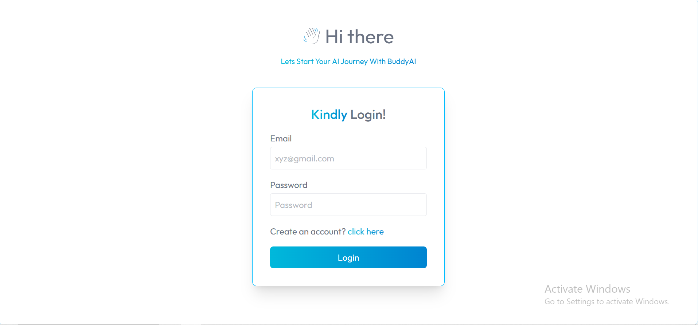
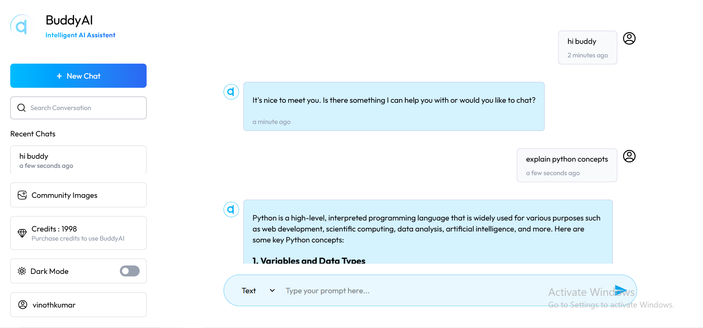
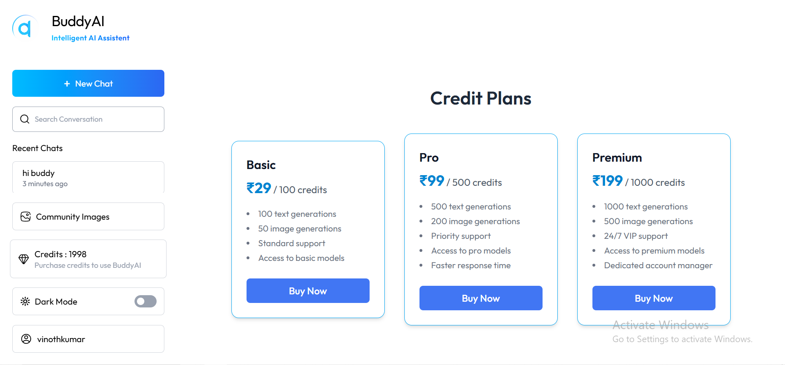
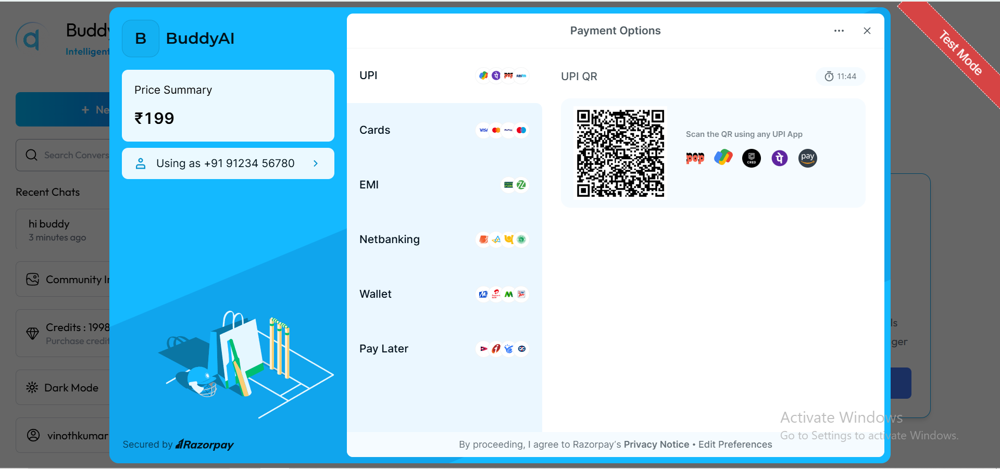

# 🤖 BuddyAI

An AI-powered chat application built with the MERN stack that enables users to interact with multiple AI models, generate AI images, and manage usage through a credit-based payment system powered by Razorpay.

---

## 🚀 Live Demo

🔗 https://trybuddyai.vercel.app

---

## 📖 About The Project

BuddyAI is a full-stack AI platform that combines conversational AI, image generation, secure authentication, and online payments into a single modern application.

Users can create accounts, chat with multiple AI models, generate AI-powered images, manage conversations, purchase credits through Razorpay, and securely access their chat history.

The project follows a scalable MERN architecture and integrates industry-standard services such as OpenAI, Groq, ImageKit, and Razorpay.

---

## ✨ Features

### 🔐 Authentication & Authorization

* User Registration
* User Login
* JWT Authentication
* Protected Routes
* Secure API Access
* Password Hashing

### 💬 AI Chat

* Real-Time AI Conversations
* Multiple AI Model Support
* Context-Aware Responses
* Persistent Chat History
* Create New Chats
* Delete Existing Chats

### 🎨 AI Image Generation

* Generate Images from Text Prompts
* AI-Powered Image Creation
* Image Storage & Retrieval

### 💳 Credit System

* Credit-Based Usage Tracking
* Automatic Credit Deduction
* Credit Balance Management
* Purchase Additional Credits
* Real-Time Credit Updates

### 💰 Razorpay Payment Gateway

* Secure Online Payments
* Credit Purchase Workflow
* Backend Payment Verification
* Transaction Management
* Payment Status Handling

### 🌙 Modern User Experience

* Responsive Design
* Mobile-Friendly Interface
* Smooth User Experience
* Toast Notifications
* Markdown Rendering
* Syntax Highlighting for Code Responses

### 🛡️ Security Features

* JWT Authentication
* Password Encryption
* API Rate Limiting
* Protected Backend Routes
* Secure Environment Variables
* Payment Verification

---

## 🛠️ Tech Stack

### Frontend

* React.js
* Vite
* Tailwind CSS
* React Router DOM
* Axios
* React Markdown
* Remark GFM
* PrismJS
* Moment.js
* React Hot Toast

### Backend

* Node.js
* Express.js
* MongoDB
* Mongoose
* JWT Authentication
* bcryptjs
* Express Rate Limit

### AI Services

* Gemini API
* Groq API

### Payment Gateway

* Razorpay

### Cloud Services

* ImageKit

---

## 📦 Dependencies

### Frontend Dependencies

| Package                 | Purpose                          |
| ----------------------- | -------------------------------- |
| React                   | UI Development                   |
| React DOM               | DOM Rendering                    |
| React Router DOM        | Client-side Routing              |
| Axios                   | API Requests                     |
| React Hot Toast         | Notifications                    |
| React Markdown          | Markdown Rendering               |
| Remark GFM              | GitHub-Flavored Markdown Support |
| PrismJS                 | Syntax Highlighting              |
| Moment.js               | Date Formatting                  |
| Tailwind CSS            | Styling                          |
| @tailwindcss/typography | Typography Styling               |
| @tailwindcss/vite       | Tailwind Integration             |

### Backend Dependencies

| Package            | Purpose                       |
| ------------------ | ----------------------------- |
| Express            | Backend Framework             |
| Mongoose           | MongoDB ODM                   |
| Axios              | HTTP Requests                 |
| bcryptjs           | Password Hashing              |
| jsonwebtoken       | Authentication                |
| cors               | Cross-Origin Resource Sharing |
| dotenv             | Environment Variables         |
| express-rate-limit | Rate Limiting                 |
| Razorpay           | Payment Gateway               |
| Gemini SDK         | AI Integration                |
| Groq SDK           | AI Integration                |
| ImageKit           | Image Generation              |
| crypto             | Cryptographic Utilities       |

### Development Dependencies

#### Frontend

* Vite
* ESLint
* @vitejs/plugin-react
* eslint-plugin-react-hooks
* eslint-plugin-react-refresh
* @types/react
* @types/react-dom

#### Backend

* Nodemon

---

## 📂 Project Structure

```bash
BuddyAI
│
├── client
│   ├── public
│   ├── src
│   │   ├── assets
│   │   ├── components
│   │   ├── context
│   │   ├── pages
│   │   ├── App.jsx
│   │   └── main.jsx
│   │
│   └── package.json
│
├── server
│   ├── configs
│   ├── controllers
│   ├── middleware
│   ├── models
│   ├── routes
│   ├── server.js
│   └── package.json
│
├── screenshots
│   ├── login.png
│   ├── chat.png
│   ├── plans.png
│   └── payment.png
│
└── README.md
```

---

## 📸 Screenshots

### 🔐 Login Page



### 💬 AI Chat Interface



### 💳 Credit Plans



### 💰 Razorpay Payment Gateway



---

## ⚙️ Environment Variables

### Backend (.env)

```env
MONGODB_URI=your_mongodb_connection_string

JWT_SECRET=your_jwt_secret

GEMINI_API_KEY=your_openai_api_key

GROQ_API_KEY=your_groq_api_key

IMAGEKIT_PUBLIC_KEY=your_imagekit_public_key
IMAGEKIT_PRIVATE_KEY=your_imagekit_private_key
IMAGEKIT_URL_ENDPOINT=your_imagekit_url_endpoint

RAZORPAY_TEST_API_KEY=your_razorpay_key_id
RAZORPAY_TEST_SECRET_KEY=your_razorpay_key_secret
RAZORPAY_WEBHOOK_SECRET=your_webhook_secret
```

### Frontend (.env)

```env
VITE_SERVER_URL=http://localhost:3000

VITE_RAZORPAY_TEST_API_KEY=your_razorpay_key_id
```

---

## 📦 Installation

### 1. Clone the Repository

```bash
git clone https://github.com/vinothkumarS1710/BuddyAI.git

cd BuddyAI
```

### 2. Install Frontend Dependencies

```bash
cd client

npm install
```

### 3. Install Backend Dependencies

```bash
cd ../server

npm install
```

---

## ▶️ Running The Application

### Start Backend Server

```bash
cd server

npm run server
```

### Start Frontend

```bash
cd client

npm run dev
```

---

## 🌐 Local URLs

```text
Frontend: http://localhost:5173

Backend: http://localhost:3000
```

---

## 💳 Credit Plans

| Plan     | Credits      | Price |
| -------- | ------------ | ----- |
| Basic    | 100 Credits  | ₹29   |
| Pro      | 500 Credits  | ₹99   |
| Premium  | 1000 Credits | ₹199  |

> Update the table if your pricing changes.

---

## 🌟 Key Highlights

* Full-Stack MERN Application
* AI Chat Integration
* AI Image Generation
* OpenAI & Groq Integration
* Razorpay Payment Gateway
* Credit-Based Monetization System
* Secure JWT Authentication
* Rate Limiting Protection
* Responsive User Interface

---

## 🎯 Future Enhancements

* Voice-Based AI Assistant
* AI File Analysis
* PDF Summarization
* AI Code Generation
* Chat Sharing
* Team Collaboration
* Subscription Plans
* Multi-Language Support

---

## 👨‍💻 Author

### Vinoth Kumar S

Full Stack Developer | MERN Stack Enthusiast | AI Application Developer

#### Connect With Me

* GitHub: https://github.com/vinothkumarS1710
* LinkedIn: https://www.linkedin.com/in/vinoth-fullstack

---

## 🤝 Contributing

Contributions, issues, and feature requests are welcome.

Feel free to fork the repository and submit a pull request.

---

## ⭐ Support

If you found this project useful, consider giving it a ⭐ on GitHub.

Your support helps the project grow and motivates future improvements.

---

## 📜 License

This project is licensed under the MIT License.
